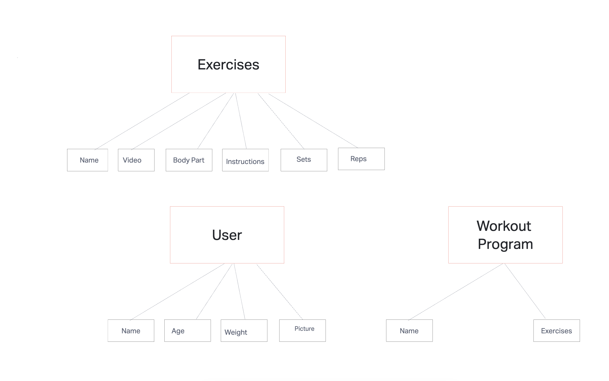

# 201-workout

[Deployed link](https://workout-tracker-201.netlify.app/)

Group members: Samaad Turner, Joshua Shea, Ekaterina Khoroshilova, John Gause

Workout Tracker:
The workout tracker tracks individual's weekly/daily workouts to be performed as well as the required reps and sets of each exercise. Also includes a page that lists exercises and informs the user how to perform each exercise.  
-This website helps to track an individual's progress from weight lifting to help keep that person motivated as well as to help not hit a plateau.  
-Have a home page that allows a user to add a workout/program from a different page and have that workout page be accessible from the home page.  
  
## Link to user stories: 
https://docs.google.com/document/d/18l8mIC3-oeqC7gRbBAEToxoZHa8HJAcKux1_i2AiZ50/edit?usp=sharing    

## Link to WireFrame:  
https://joshuashea812854.invisionapp.com/freehand/workout-tracker-wireframe-au7bUkGlf

## Domain Modeling

